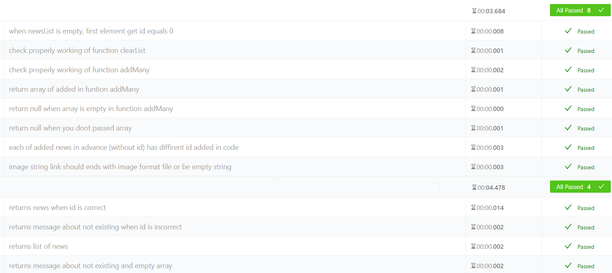
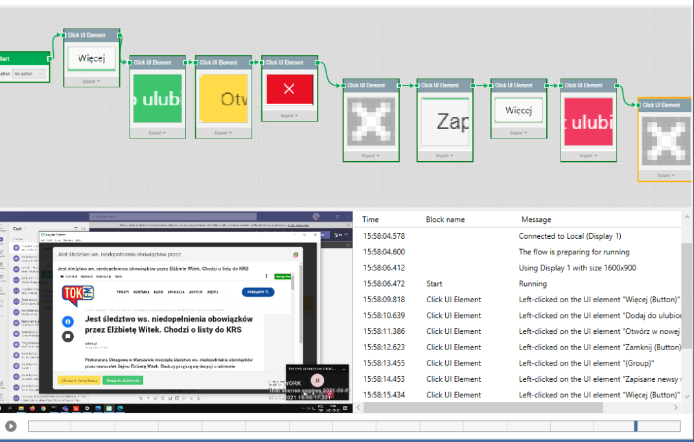

(projekt zaliczeniowy przedmiotu In¿ynieria Oprogramowania)
# News Search

#### News Search - aplikacja wyszukiwuj¹ca newsy!
> Aplikacja wyszukiwuje newsy z trzech najwiêkszych portali (za pomoc¹ Web Scrappingu) i zestawia je w desktopowej aplikacji. Aplikacja umo¿liwia wyœwietlanie listy newsów, fitrowanie jej, wyœwietlanie szczegó³owych informacji - wraz z opcj¹ przejœcia do strony na której news zosta³ upublikowany oraz dodanie do listy ulubionych. W aplikacji dostêpna jest równie¿ ma³a konfiguracja - dane tej konfiguracji zapisane s¹ w pliku oraz ³adowane przy ka¿dym uruchomieniu aplikacji.

## Specyfikacja wymagañ

1) **Wymagania funkcjonalne** 

Nie ujeliœmy kategorii zale¿noœci od systemu i oprogramowania bo jest to nieistotne w naszyym projekcie. Nasza aplikacja jest multiplatformowa – dzia³aj¹ca niezale¿nie od systemu operacyjnego. Jest to aplikacja desktopowa nieposiadaj¹ca dodatkowego oprogramowania potrzebnego do uruchomienia aplikacji.

|**Identyfikator**|**Nazwa krótka**|**Opis**|**Priorytet**|
| :-: | :-: | :-: | :-: |
|W\_FUN\_1|Wyœwietlanie listy|Aplikacja powinien umo¿liwiæ wyœwietlenie listy wiadomoœci (ostatnie 50 wzglêdem danej kategorii oraz stron internowej) o prace wzglêdem daty dodania do portalu. Jako u¿ytkownik systemu otrzymam dostêp do og³oszeñ na bie¿¹co.|1 (wymagane)|
|W\_FUN\_2|Webscrapping danych| Serwer powinien na rz¹dzanie klienta wykonaæ Web Scrapping stron aby odes³aæ odpowiedz z aktualn¹ list¹ wiadomoœci. Jako u¿ytkownik mogê na bie¿¹co spradzaæ listê og³oszeñ o pracê odœwie¿ajaæ listê za pomoc¹ przycisku. |1 (wymagane)|
|W\_FUN\_3|Lista ulubionych| Aplikacja powinna umo¿liwiæ dodawanie wiadomoœci do ulubionych aby mieæ dostêp do niego poŸniej (zapisany w aplikacji). Jako u¿ytkownik mam dostêp do zapisanych i w ka¿dej chwili mogê je wyœwietliæ. |2 (oczekiwana)|
|W\_FUN\_4|Filtrowanie | Aplikacja umo¿liwia filtrowanie rezultatów Jako u¿ytkownik mam dostep do filtrowania stron internetowych. |2 (oczekiwana)|
|W\_FUN\_5|Podgl¹d wiadomoœci| Aplikacja umo¿liwa podgl¹d wiadomoœci. Jako u¿ytkownik mam dostêp do przycisku wyœwieltaj¹cego ca³y opis og³oszenia. |2 (oczekiwana)|
|W\_FUN\_6|Przejœcie do wiadomoœci oryginalnej|Aplikacja umo¿liwia przejœcie z wiadomoœci wyœwietlanej w aplikacji do oryginalnego og³oszenia. Jako u¿ytkownik mogê przejœæ do strony wyœwietlaj¹cej og³osznie.|3 (dodatkowa)|
|W\_FUN\_7|Kontrola blêdów dotycz¹ca pobierania danych z serwera.|Aplikacja wyœwietli informacje gdy niemo¿liwe bêdzie pobranie danych z serwera udostêpniajac przycisk – spróbuj ponownie.|2 (oczekiwana)|
|W\_FUN\_8|Konfiguracja |Aplikacja umo¿liwia konfigurowanie opcji wyœwietlania newsów - zapis konfiguracji w pliku json.|3 (dodatkowa)|

2) **Wymagania niefuncjonalne**

|**Identyfikator**|**Podkategoria**|**Nazwa krótka**|**Opis**|**Priorytet**|
| :- | :- | :- | :- | :- |
|W\_NIEFUN\_1|3 - wydajnoœæ|Zapewnienie wydajnoœci|Zapewnienie wydajnoœci oraz niezawadnoœci oprogramowania. Zapewnienie najkrótszego ³adowania danych.|1 (wymagane)|
|W\_NIEFUN\_2|2 - bezpieczeñstwo|Poufnoœæ danych|Wszelkie dane zabezpieczone w aplikacji. Brak wyp³ywania danych na zewn¹trz. Przechowywanie tylko na dysku u¿ytkownika.|1 (wymagane)|
|W\_NIEFUN\_3|1 - projektowe|Wolnoœæ oprogramowania|Dostarczane przez nas oprogamowanie jest wolne, kod jest otwarty i ogólnodostepny|1 (wymagane)|
|W\_NIEFUN\_4|1 - projektowe|Kompatybilnoœæ |Oprogramowanie klienckie dostêpne i dzia³aj¹ce na konkurencyjnych systemach operacyjnych|2 (oczekiwane)|
|W\_NIEFUN\_5|4 – ergonomia UI |Design|Prosty, lecz dobrze wygl¹daj¹cy interfejs u¿ytkownika, który w sposób intuicyjny pozwoli na wykorzystywanie funkcji.|3 (dodatkowa)|

## Stack technologiczny

### Client
- electron.js 1.0.4
- angular 11 (https://github.com/maximegris/angular-electron)
- bulma css framework 0.9.2
- scss 
- node.js 12.18.1^,

### Server
- node.js 12.18.1^, 
- express.js 1.0.0^,
- crawler 1.3.0
- jest (testing)

## Architektura 
#### Architektura rozwoju
- Visual Studio Code jako edytor kodu,
- Leapwork (do testów Klienta)

#### Architektura uruchomieniowa
- Serwer uruchomiony na wieloplatformowym œrodowisku uruchomieniowym Node.js,
- Aplikacja klienta dostêpna na systemy operacyjne: macOS, Windows oraz Linux uruchioma na otwartym silniku Chrominium 
(otwarty projekt przegl¹darki internetowej, z którego kod Ÿród³owy czerpi¹ miêdzy innymi Google Chrome, slu¿y do do wyœwietlania treœci internetowych),

#### Testy
Testowanie poprawnoœci funkcjanalnoœci serwera odby³o siê za pomoc¹ frameworka jest.js

Natomiast testowanie aplikacji odby³o siê przy pomocy platformmy do automatyzacji testów Leapwork.

